# Database Schema - Marketplace ของสะสม (MVP)

> Stack: **.NET 8 Web API + EF Core (Code-First) + SQL Server + Worker/BackgroundService**
> Author: lead-dev | Date: 2026-06-17 | Companion DDL: `../sql/schema.sql`

เอกสารนี้อธิบาย schema ที่ออกแบบ **ตามข้อจำกัดกฎหมายที่ทีม Legal สรุปมา** ทุก design choice
สำคัญมีเหตุผลเชิงกฎหมายกำกับ (PDPA, พ.ร.บ.ระบบการชำระเงิน 2560, หมิ่นประมาท)

---

## 1. ER Overview

```mermaid
erDiagram
    Users ||--o| UserProfiles : has
    Users ||--o{ KycVerifications : undergoes
    KycVerifications ||--o| KycSensitiveData : "encrypted, optional"
    Users ||--o{ Memberships : holds
    MembershipTiers ||--o{ Memberships : defines
    Users ||--o{ Products : sells
    Categories ||--o{ Products : classifies
    Categories ||--o{ Categories : parent
    Products ||--o{ ProductImages : has
    Products ||--o| Auctions : "may be"
    Auctions ||--o{ Bids : receives
    Users ||--o{ Bids : places
    Products ||--o{ Transactions : "results in"
    Users ||--o{ Transactions : "buys/sells"
    Bids ||--o| Transactions : "winning bid"
    Transactions ||--o{ TransactionStatusHistory : logs
    Transactions ||--o{ Reviews : "rated via"
    Transactions ||--o{ Disputes : "may raise"
    Users ||--o| TrustScores : has
    Users ||--o{ TrustScoreHistory : accumulates
    BlacklistReasonCodes ||--o{ TrustScoreHistory : "reason"
    Users ||--o{ PenaltyActions : "subject to"
    Users ||--o{ BlacklistEntries : "flagged in"
    BlacklistReasonCodes ||--o{ BlacklistEntries : "reason"
    BlacklistReasonCodes ||--o{ PenaltyActions : "reason"
    BlacklistReasonCodes ||--o{ Disputes : "reason"
    Users ||--o{ FeeInvoices : "billed (company fee)"
    Users ||--o| ReferralCodes : owns
    Users ||--o{ Referrals : "refers (single-level)"
    Users ||--o| CreditAccounts : has
    Users ||--o{ CreditTransactions : "credit ledger"
    Products ||--o{ ListingPromotions : "promoted via"
    PromotionPackages ||--o{ ListingPromotions : prices
    CreditTransactions ||--|| ListingPromotions : "debits (PromoSpend, 1:1)"
    Users ||--o{ ConsentRecords : "PDPA consent"
    Users ||--o{ AuditLogs : "actor"
    Users ||--o{ Notifications : "notified"
    Memberships ||--o{ Notifications : "lifecycle notice (14/3/1)"
    Products ||--o{ AppraisalOpinions : "appraised"
    Users ||--o{ AppraisalOpinions : "appraiser"
    Users ||--o{ ConfigVersions : "config changed by"
```

**Domain groups:** Identity (Users, UserProfiles, KYC) · Catalog (Categories, Products, Images)
· Auction (Auctions, Bids) · Trade record (Transactions, History — *no money held*) · Reputation
(Reviews, TrustScore, Penalty, Blacklist, Disputes) · Company revenue (FeeInvoices) · Growth
(ReferralCodes, Referrals, CreditAccounts, CreditTransactions, PromotionPackages, ListingPromotions —
*non-cashable credit, single-level referral*) · Compliance (ConsentRecords, AuditLogs) · Engagement
(Notifications) · Trust/Provenance (AppraisalOpinions) · Config (ConfigVersions).

> **จำนวนตารางรวม: 33 ตาราง** (`CREATE TABLE` 33 จุดใน `sql/schema.sql`) — เดิม 30 + เพิ่ม 3 จาก Blocker fix
> (`Notifications`, `AppraisalOpinions`, `ConfigVersions`).
> *หมายเหตุ:* QA report ระบุ "32 ตาราง" เป็นการนับคลาดเคลื่อน — ตัวเลขก่อนแก้คือ 30, หลังแก้คือ **33**.
> นอกจากนี้มี 3 INSTEAD OF UPDATE/DELETE trigger (append-only enforcement) ที่ไม่นับเป็นตาราง.

---

## 2. ตารางทั้งหมด (รายคอลัมน์ / PK / FK / index / constraint)

> ชนิดข้อมูลมาตรฐาน: PK = `UNIQUEIDENTIFIER` (NEWSEQUENTIALID) สำหรับ entity หลัก,
> `INT/BIGINT IDENTITY` สำหรับ lookup/log, เวลาใช้ `DATETIME2(3)` UTC, เงินใช้ `DECIMAL`,
> concurrency ใช้ `ROWVERSION`.

### 2.1 Lookup / Enum tables
| Table | PK | คอลัมน์สำคัญ | หมายเหตุ |
|---|---|---|---|
| **KycStatuses** | KycStatusId (TINYINT) | Code, DisplayName | NONE/PENDING/VERIFIED/REJECTED/EXPIRED |
| **BlacklistReasonCodes** | ReasonCodeId (INT) | Code, DisplayName, Severity(1-5), DefaultScorePenalty | เหตุผลมาตรฐานใช้ร่วมกันทั้ง Blacklist/Penalty/TrustScore/Dispute |
| **Categories** | CategoryId (INT IDENTITY) | ParentCategoryId(self FK), Slug(UNIQUE) | รองรับ category tree |
| **MembershipTiers** | MembershipTierId (TINYINT) | Code, RequiresKyc, MonthlyFee, **AnnualPriceTHB** | Normal=1000 / Verified=1500 / Premium=2000 THB/ปี; Verified+Premium ต้อง KYC |
| **PromotionPackages** | PromotionPackageId (TINYINT) | Code, PromotionType, DurationDays, CreditCost | แพ็กเกจโปรโมตประกาศ จ่ายด้วยเครดิต (Featured/TopOfList/Highlight) |

### 2.2 Users & Profile
**Users** — PK UserId. คอลัมน์: Email, NormalizedEmail, PasswordHash(null=NDID/social),
PhoneNumber, Role, **AccountStatus(Active/Suspended/PendingBanReview/Banned)**, EmailConfirmed,
**IsDeleted / IsAnonymized / DeletedAtUtc** (PDPA soft-delete), CreatedAtUtc, UpdatedAtUtc, RowVersion.
- Index: `UX_Users_NormalizedEmail` UNIQUE **filtered `WHERE IsDeleted=0`** (รองรับ anonymize/re-register)
- CHECK: Role, AccountStatus
- **B-05/G-5:** เพิ่ม state `PendingBanReview` (เสนอ ban อัตโนมัติ รอ Admin ยืนยัน — human-in-the-loop, due-process DP-3
  ห้าม auto-ban ถาวรล้วน; แยก "เสนอ ban" ออกจาก "ban แล้ว" ตาม SRS §6.2)

**UserProfiles** — PK/FK UserId (1:1, ON DELETE CASCADE). DisplayName, AvatarUrl, Bio, ProvinceCode.
แยกออกจาก Users เพื่อกันข้อมูล display ปนกับ credential.

### 2.3 KYC
**KycVerifications** — PK KycVerificationId. UserId(FK), KycStatusId(FK), **Provider, ProviderReference**
(token จาก NDID/vendor — *ไม่ใช่เลขบัตร*), VerificationLevel, VerifiedAtUtc, ExpiresAtUtc.
**KycSensitiveData** — PK/FK KycVerificationId (1:1 optional, CASCADE). `FullNameMasked` **[ENCRYPTED]**,
`NationalIdHash VARBINARY` **[ENCRYPTED] (hash ไม่ใช่เลขดิบ)**, **RetentionExpiresAtUtc** (worker ลบเมื่อหมดอายุ).
สร้างเฉพาะกรณีกฎหมายบังคับเก็บเท่านั้น.

### 2.4 Membership
**Memberships** — PK MembershipId. UserId(FK), MembershipTierId(FK), **Status (Trial/Active/Expired/Cancelled)**,
Start/EndAtUtc, **TrialStartsAtUtc / TrialEndsAtUtc** (ทดลองฟรี 3 เดือน: TrialEndsAtUtc = วันสมัคร + 3 เดือน),
**PaidThroughUtc** (วันหมดอายุสมาชิกรายปี — worker เปลี่ยน Status→Expired เมื่อพ้น), AutoRenew,
**PaidAmountTHB** (Y-06/B-04 — snapshot ราคาที่ชำระจริงของรอบนี้), Updated, RowVersion.
- Status default = `Trial`; CHECK เพิ่ม `Trial`
- Index: `UX_Membership_LivePerUser` UNIQUE filtered `WHERE Status IN ('Trial','Active')`
  (1 user มี membership ที่ยังมีผล — trial หรือ active — ได้ครั้งละ 1)
- Index: **`IX_Membership_Expiry` (Status, PaidThroughUtc, TrialEndsAtUtc)** (S-03 — worker สแกนหมดอายุ/แจ้งเตือนเร็ว, FR-27)
- CHECK: `TrialEndsAtUtc > TrialStartsAtUtc`
- **Y-05:** `CK_Membership_TrialHasEnd` — Status='Trial' ต้องมี `TrialEndsAtUtc IS NOT NULL` (กัน trial ไม่มีวันหมด, FR-27/Legal #8)
- **Y-06/B-04:** `PaidAmountTHB` snapshot ราคาตอนชำระ → การเปลี่ยนราคาภายหลัง (ConfigVersions) **ไม่ย้อนหลัง**กระทบรอบที่ชำระแล้ว (FR-31)

### 2.5 Catalog
**Products** — PK ProductId. SellerId(FK), CategoryId(FK), Title, Description, ConditionGrade,
ListingType(FixedPrice/Auction), FixedPrice(nullable, asking price — *ระบบไม่ถือเงิน*), Currency, Status, IsDeleted, RowVersion.
- Index: `IX_Products_Seller`, `IX_Products_Category_Status` (filtered IsDeleted=0)
- CHECK: ListingType, Status, FixedPrice>=0

**ProductImages** — PK ProductImageId. ProductId(FK CASCADE), Url, SortOrder, IsPrimary.

### 2.6 Auction & Bids
**Auctions** — PK AuctionId. ProductId(FK, UNIQUE 1:1), StartingPrice, ReservePrice, BidIncrement,
CurrentHighBid(snapshot), **WinningBidId(FK เพิ่มภายหลังเลี่ยง circular)**, Start/EndAtUtc,
Status(Scheduled/Open/Closed/Cancelled), RowVersion.
- CHECK: EndAtUtc>StartAtUtc, ReservePrice>=StartingPrice
- Index: `IX_Auctions_Status_End` (BackgroundService สแกนปิดประมูล)

**Bids** — PK BidId. AuctionId(FK), BidderId(FK), Amount, Status(Active/Outbid/Won/Retracted/Voided).
**Anti-shill fields: `IpAddressHash VARBINARY(32)`, `DeviceFingerprintHash VARBINARY(32)`,
`IsFlaggedShill BIT`, `RelationshipFlag` (SAME_DEVICE/SAME_IP/LINKED_ACCOUNT).**
- Index: `IX_Bids_Auction_Amount (Amount DESC)`, `IX_Bids_Bidder`, `IX_Bids_Shill` (filtered IsFlaggedShill=1)

### 2.7 Transactions (No-touch payment) — สำคัญที่สุดเชิงกฎหมาย
**Transactions** — PK TransactionId. ProductId, SellerId, BuyerId, WinningBidId(nullable), **AgreedAmount**
(อ้างอิง/คำนวณ fee เท่านั้น), Currency, Status, **ExternalPaymentNote** (หมายเหตุการโอนนอกระบบ),
CreatedAtUtc, TransferredAtUtc, ConfirmedAtUtc, RowVersion.
- Status flow: `Pending -> Transferred -> Confirmed | Disputed | Cancelled` — **ไม่มี Held/Escrow/Refunded**
- CHECK: BuyerId<>SellerId, AgreedAmount>=0
- *ไม่มีคอลัมน์ balance/wallet/amount_held ใด ๆ — ระบบไม่ถือเงินจริง*

**TransactionStatusHistory** — PK BIGINT IDENTITY. TransactionId(FK CASCADE), FromStatus, ToStatus,
ChangedByUserId(null=worker), Note, ChangedAtUtc. บันทึกทุกการเปลี่ยนสถานะ.

### 2.8 Reviews
**Reviews** — PK ReviewId. TransactionId(FK), ReviewerId, RevieweeId, Rating(1-5), Comment, IsHidden(moderation).
- CHECK: Rating 1-5, Reviewer<>Reviewee; UNIQUE `(TransactionId, ReviewerId)` (รีวิวได้ครั้งเดียว/ธุรกรรม)

### 2.9 Trust Score
**TrustScores** — PK/FK UserId (1:1, CASCADE). Score(DEFAULT 100, CHECK 0-100), LastCalculatedAtUtc, RowVersion.
**TrustScoreHistory** — PK BIGINT IDENTITY. UserId(FK), Delta, ScoreAfter, **ReasonCodeId(FK มาตรฐาน)**,
RelatedTransactionId, Note, CreatedByUserId(null=ระบบ). Worker คำนวณ: เริ่ม 100, -20/ลหุโทษ, <60=Suspended.

### 2.10 Penalty & Blacklist
**PenaltyActions** — PK PenaltyActionId. UserId, ActionType(Warning/ScoreDeduct/Suspend/Ban),
ReasonCodeId(FK), RelatedTransactionId, IssuedByUserId(null=auto), Effective/ExpiresAtUtc.
**BlacklistEntries** (ระบบเตือนภายใน) — PK BlacklistEntryId. UserId, **ReasonCodeId(FK มาตรฐาน — ไม่เก็บถ้อยคำหมิ่น)**,
InternalNote(ข้อเท็จจริง), **ReviewStatus** (PendingReview/Confirmed/Rejected/Appealed/Overturned),
**AppealStatus** (None/Requested/UnderReview/Accepted/Denied), AppealNote, CreatedBy/ReviewedByUserId,
Effective/**ExpiresAtUtc** (ต้องมีวันหมดอายุ), IsActive.
- Index: `IX_Blacklist_User` filtered IsActive=1

### 2.11 Disputes
**Disputes** — PK DisputeId. TransactionId(FK), RaisedByUserId, ReasonCodeId(FK), Description,
Status(Open/UnderReview/Resolved/Rejected/Escalated), Resolution, HandledByUserId, Created/ResolvedAtUtc.

### 2.12 FeeInvoices (เงินบริษัท — แยกขาดจากเงินซื้อขาย)
**FeeInvoices** — PK FeeInvoiceId. UserId(FK), **FeeType**
(Membership/**MembershipRenewal**/**MembershipUpgrade**/Listing/Premium/Featured),
RelatedMembershipId, RelatedProductId, Amount, Currency, Status(Issued/Paid/Void/Overdue),
Issued/Due/PaidAtUtc, **ExternalPaymentRef** (จาก gateway บริษัท). นี่คือรายได้บริษัท *ไม่ปน*กับการโอน buyer<->seller.
- ค่าสมาชิกรายปี + ต่ออายุ + อัพเกรด tier ทั้งหมดออกใบแจ้งหนี้ผ่านที่นี่ (เงินบริษัทล้วน ไม่มี wallet/balance)

### 2.13 Referral (single-level เท่านั้น)
**ReferralCodes** — PK ReferralCodeId. UserId(FK, **UNIQUE 1 code/คน**), Code(**UNIQUE**), IsActive, CreatedAtUtc.
**Referrals** — PK ReferralId. ReferrerUserId(FK), ReferredUserId(FK, **UNIQUE — ถูกชวนได้ครั้งเดียว**),
ReferralCode, Status(Pending/Qualified/Rewarded/Rejected), **RewardCreditToReferrer / RewardCreditToReferred**
(จ่ายเป็นเครดิต ไม่ใช่เงินสด), RewardedAtUtc, CreatedAtUtc.
- CHECK: `ReferrerUserId <> ReferredUserId` (กัน self-referral)
- **กฎหมาย/ดีไซน์: single-level เท่านั้น — ไม่มี ParentReferralId / UplineUserId / Level**
  flat ทั้งหมด เพื่อเลี่ยงการเข้าข่ายขายตรง/MLM/แชร์ลูกโซ่ (พ.ร.บ.ขายตรงและตลาดแบบตรง)
- Index: `IX_Referral_Referrer`

### 2.14 Platform Credit (non-cashable, non-transferable)
**CreditAccounts** — PK/FK UserId (1:1, CASCADE). **Balance** (maintained จาก ledger, CHECK ≥0), Updated, RowVersion.
**CreditTransactions** (ledger **append-only**) — PK BIGINT IDENTITY. UserId(FK), **Amount(+/-)**,
**Type (ReferralReward/PromoSpend/Adjustment/Expiry/Revoke)**, RefId, **IdempotencyKey**, **BalanceAfter(CHECK ≥0)**,
**ExpiresAtUtc** (nullable — สำหรับเครดิตที่ได้รับและหมดอายุได้), Note, CreatedAtUtc.
- Index: `IX_CreditTx_User`, `IX_CreditTx_Expiry` (filtered ExpiresAtUtc IS NOT NULL — worker หักหมดอายุ)
- **B-02/G-2 idempotency กัน double-credit:** UNIQUE `UX_CreditTx_Idempotency (IdempotencyKey)` filtered IS NOT NULL
  + UNIQUE `UX_CreditTx_TypeRef (Type, RefId)` filtered RefId IS NOT NULL → retry/ดับเบิลคลิก/worker รันซ้ำ ไม่ให้รางวัล/หักเครดิตซ้ำ
  (FR-28/29/30). แอปต้อง insert ledger + อัปเดต balance ใน transaction เดียว
- **S-04:** เพิ่ม Type `Revoke` (ริบเครดิตที่เคยได้ เช่น referral abuse) แยกจาก `Adjustment` ที่กำกวม
- **B-06/G-6:** มี **INSTEAD OF UPDATE, DELETE trigger** `TR_CreditTransactions_NoModify` → ปฏิเสธการแก้/ลบระดับ DB (ดู §2.17)
- **กฎหมาย: เครดิต = แต้มบริการ ไม่ใช่ e-money** — ถอน/แลกเงินสดไม่ได้ โอนให้ผู้อื่นไม่ได้
  *ไม่มี* Type/ตาราง/คอลัมน์ Withdraw/CashOut/Transfer ใด ๆ → อยู่นอก พ.ร.บ.ระบบการชำระเงิน 2560
  (เครดิตหมดอายุได้ = ไม่ใช่ stored value เงินจริง)

### 2.15 Featured / Promoted Listings (จ่ายด้วยเครดิต)
**PromotionPackages** (lookup) — PK PromotionPackageId(TINYINT). Code, PromotionType(Featured/TopOfList/Highlight),
DurationDays, CreditCost, IsActive. (seed: FEAT_7 / TOP_3 / HL_7)
**ListingPromotions** — PK ListingPromotionId. ProductId(FK), UserId(FK ผู้ซื้อโปรโมชัน),
PromotionPackageId(FK nullable), PromotionType, CreditCost, StartsAtUtc, EndsAtUtc,
Status(Active/Expired/Cancelled), **CreditTransactionId(FK → CreditTransactions ที่หักเครดิต PromoSpend — NOT NULL + UNIQUE)**, CreatedAtUtc.
- CHECK: PromotionType, Status, `EndsAtUtc > StartsAtUtc`, `CreditCost >= 0`
- Index: `IX_ListPromo_Product`, `IX_ListPromo_Active_End` (filtered Status='Active' — worker หมดอายุ)
- **Y-08:** `CreditTransactionId` เปลี่ยนเป็น **NOT NULL + UNIQUE** (`UQ_ListPromo_CreditTx`) — promotion สร้างได้หลังหักเครดิตสำเร็จเท่านั้น
  และ ledger row หนึ่งผูกกับ promotion เดียว (กันโปรโมตไม่ผูก ledger / ผูกซ้ำ; สอดคล้อง B-02)

### 2.16 PDPA: Consent & Audit
**ConsentRecords** — PK BIGINT IDENTITY. UserId, ConsentType(ToS/Privacy/Marketing/DataProcessing),
DocumentVersion, IsGranted(grant/withdraw), SourceIpHash. เก็บทุก event (append-only).
**AuditLogs** — PK BIGINT IDENTITY. ActorUserId(who, null=system), Action(what), EntityType, EntityId,
**BeforeJson / AfterJson** (when+before/after), IpAddressHash, **CorrelationId** (S-06/NFR-A2 — ผูกทุก audit row
ที่เกิดในธุรกรรม/คำขอเดียวกัน เพื่อสืบย้อน AML/due-process; index `IX_Audit_Correlation` filtered IS NOT NULL).
ครอบ who/what/when/before-after ตาม PDPA.
- **B-06/G-6:** `ConsentRecords` และ `AuditLogs` มี **INSTEAD OF UPDATE, DELETE trigger** ปฏิเสธการแก้/ลบระดับ DB (ดู §2.17)

### 2.17 Notifications · Appraisal · Config versioning · Append-only triggers (Blocker fixes)

**Notifications** (B-01/G-1) — PK NotificationId. UserId(FK), **Type** (TrialExpiring/RenewalDue/RenewalCharged/
MembershipExpired/PromotionExpiring/PenaltyIssued/AppealUpdate), **Channel** (Email/InApp/Sms),
RelatedMembershipId(FK nullable), **Milestone** (14/3/1 หรือ NULL), ScheduledForUtc, SentAtUtc(nullable),
Status(Pending/Sent/Failed/Skipped), CreatedAtUtc.
- Index: `IX_Notif_User`, `IX_Notif_Due` (filtered Status='Pending' — worker เลือกที่ถึงกำหนด)
- **UNIQUE `UX_Notif_NoDup` (UserId, Type, RelatedMembershipId, Milestone)** filtered (RelatedMembershipId & Milestone IS NOT NULL)
  → กันแจ้งซ้ำต่อ (user, type, membership, milestone) — worker re-run ปลอดภัย
- **เหตุผลกฎหมาย:** FR-27 บังคับแจ้งล่วงหน้า 14/3/1 วัน + **log การแจ้ง**; auto-renew ทำได้เฉพาะหลังแจ้งแล้ว;
  Legal #8 (คุ้มครองผู้บริโภค) ต้อง **พิสูจน์ได้ว่าแจ้งก่อนตัดเงิน** — ตารางนี้คือ audit trail + idempotency guard ของ worker

**AppraisalOpinions** (B-03/G-3) — PK AppraisalOpinionId. ProductId(FK), AppraiserUserId(FK nullable),
AppraiserName, OpinionText, **DisclaimerVersion**, IsPublished, CreatedAtUtc.
- Index: `IX_Appraisal_Product` (filtered IsPublished=1)
- **เหตุผลกฎหมาย:** FR-07/IS-8 เก็บความเห็นผู้ประเมินอิสระ; Legal #2 แพลตฟอร์ม**ไม่รับประกันความแท้** —
  ทุกความเห็นเป็น "opinion" + เก็บ `DisclaimerVersion` พิสูจน์ได้ว่าแสดง disclaimer เวอร์ชันใดตอนนั้น
  (UI ต้องเลี่ยงคำว่า "รับประกัน/ของแท้ 100%")

**ConfigVersions** (B-04/G-4) — PK BIGINT IDENTITY. **ConfigKey** (เช่น `MembershipTier.Premium.AnnualPriceTHB`,
`Kyc.ValueThresholdTHB`), **Value**, **EffectiveFromUtc**, CreatedByUserId(FK nullable), Note, CreatedAtUtc.
- UNIQUE `UQ_ConfigVer_KeyEffective (ConfigKey, EffectiveFromUtc)`; Index `IX_ConfigVer_Key_Effective (ConfigKey, EffectiveFromUtc DESC)`
- resolve "ค่าของ key K ณ เวลา T" = แถวที่ EffectiveFromUtc ≤ T ล่าสุด
- **เหตุผลกฎหมาย:** FR-31 บังคับเก็บประวัติเวอร์ชัน config + effective date + **ไม่ย้อนหลัง**;
  `MembershipTiers`/`PromotionPackages` ยังเป็น lookup "ปัจจุบัน" แต่ทุกการเปลี่ยน append ที่นี่แบบ immutable + dated
  และราคาที่ชำระจริงถูก snapshot ที่ `Memberships.PaidAmountTHB` (Y-06) → เปลี่ยนราคาไม่กระทบรอบที่จ่ายแล้ว

**Append-only triggers (B-06/G-6)** — `TR_AuditLogs_NoModify`, `TR_ConsentRecords_NoModify`,
`TR_CreditTransactions_NoModify` เป็น **INSTEAD OF UPDATE, DELETE trigger** ที่ `THROW` ปฏิเสธทุกการแก้/ลบ
(INSERT ยังทำได้ — append-only). สร้างหลังตารางทั้งหมด.
- **เหตุผลกฎหมาย:** FR-24/FR-29/NFR-A1 immutable; บังคับระดับ DB ไม่ใช่แค่ระดับ app → แม้เข้า DB ตรงก็แก้ประวัติ audit/consent/ledger ไม่ได้
- **ทางเลือก hardening ตอน deploy จริง (เพิ่มเติม/แทน):** `DENY UPDATE, DELETE` บน app role (defence-in-depth),
  หรือ SQL Server 2022 **ledger table** (`WITH (LEDGER = ON)`) / **temporal table** เพื่อ immutability ที่ตรวจสอบเชิง crypto ได้

---

## 3. Enum / Lookup tables (สรุป)
| Enum domain | จัดเก็บแบบ | เหตุผล |
|---|---|---|
| KycStatus | lookup table `KycStatuses` | join เป็น label, query ง่าย |
| Reason codes | lookup `BlacklistReasonCodes` | **กฎหมาย: ใช้รหัสมาตรฐานแทนถ้อยคำอิสระ** กันหมิ่นประมาท |
| MembershipTier | lookup `MembershipTiers` | config ราคารายปี (AnnualPriceTHB)/RequiresKyc |
| PromotionPackage | lookup `PromotionPackages` | config Type/Duration/CreditCost ของการโปรโมตประกาศ |
| Role/AccountStatus/ListingType/Tx Status/... | **CHECK constraint + string** | ค่าน้อย/นิ่ง ไม่ต้อง join; map เป็น C# enum ใน EF |

EF Core: lookup ใช้ entity + seed; enum สั้น ๆ ใช้ `HasConversion<string>()` + CHECK.

---

## 4. Retention & Encryption notes
- **Always Encrypted** สำหรับคอลัมน์ [ENCRYPTED] ใน `KycSensitiveData` (FullNameMasked, NationalIdHash)
  — ผูก Column Master Key (Azure Key Vault) + Column Encryption Key ใน migration แยก ตอน deploy จริง.
  DDL ปัจจุบันใช้ชนิดธรรมดาเพื่อให้สคริปต์รันได้ก่อน.
- **ไม่เก็บ PII ดิบ:** IP / device fingerprint เก็บเป็น **hash (VARBINARY)** เท่านั้น (Bids, ConsentRecords, AuditLogs).
- **Retention:** `KycSensitiveData.RetentionExpiresAtUtc` ให้ BackgroundService ลบ/anonymize เมื่อพ้นกำหนด.
- **PDPA สิทธิ์ลบ:** Users มี `IsDeleted/IsAnonymized/DeletedAtUtc` — anonymize PII แทน hard-delete
  เพื่อรักษา referential integrity ของประวัติธุรกรรม (ทางบัญชี/ข้อพิพาทต้องเก็บ).
- **AuditLogs/ConsentRecords/CreditTransactions = append-only** ไม่มี UPDATE/DELETE จากแอป
  (เก็บเป็นหลักฐาน due process / ledger เครดิต).
- **เครดิตไม่ใช่เงินจริง:** `CreditAccounts.Balance` เป็นแต้มบริการ ไม่ใช่ wallet ที่ถอนได้
  — ไม่มี path ถอน/โอน/แลกเงินสด (ดู §2.14). การได้/ใช้เครดิต + การเปลี่ยน membership ต้องเขียนลง `AuditLogs`.

---

## 5. สิ่งที่เลื่อนไปเฟสหลัง (ตัดออกจาก MVP)
| ฟีเจอร์ | เหตุผลที่ตัด | เก็บ hook ไว้อย่างไร |
|---|---|---|
| **Wallet / Balance / Ledger (เงินจริง)** | พ.ร.บ.ระบบการชำระเงิน 2560 (ถือเงินลูกค้า=ต้องขอใบอนุญาต) | ไม่มีตารางเลย; `CreditAccounts` เป็นแต้มบริการ non-cashable เท่านั้น ไม่ใช่ wallet เงินจริง |
| **Multi-level / MLM referral** | พ.ร.บ.ขายตรงฯ + กันแชร์ลูกโซ่ | `Referrals` ออกแบบ single-level (ไม่มี upline/level) |
| **Escrow** | เหมือนข้างบน + buyer protection ขัด no-escrow | Transactions ใช้ status flow แทนชั่วคราว |
| **Pre-Order / ระดมทุน** | เสี่ยงเข้าข่ายระดมทุน/แชร์ลูกโซ่ | ไม่ออกแบบใน MVP |
| Escrow payout / payment gateway ฝั่ง trade | รอตัดสิน payment model | `ExternalPaymentRef` เผื่อไว้เฉพาะ FeeInvoices (เงินบริษัท) |

---

## 6. 5 จุดที่ schema ต่างจาก blueprint เดิมเพราะกฎหมาย
1. **ไม่มี wallet/balance/ledger** — `Transactions` เป็นเพียง *บันทึกการโอนตรงนอกระบบ*
   (Pending→Transferred→Confirmed/Disputed) + แยก `FeeInvoices` ออกมาเป็นเงินบริษัทล้วน.
2. **KYC ไม่เก็บภาพบัตร/บัญชีดิบ** — `KycVerifications` เก็บแค่ status + provider ref;
   PII ที่จำเป็นไปอยู่ `KycSensitiveData` แบบ encrypted + retention.
3. **Blacklist กลายเป็นระบบเตือนภายในมี due process** — เพิ่ม `BlacklistReasonCodes`(FK),
   `ReviewStatus`/`AppealStatus`/`ExpiresAt`; เลิกเก็บข้อความหมิ่นอิสระ.
4. **เพิ่ม ConsentRecords + AuditLogs + soft-delete/anonymize** บน Users (PDPA) — blueprint เดิมไม่มี.
5. **Bids เพิ่ม anti-shill fields** (IP hash / device fingerprint hash / IsFlaggedShill / RelationshipFlag)
   เก็บเป็น hash ไม่ใช่ค่าดิบ.
